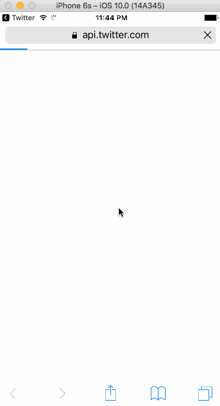

# Project 4 - Twitter Client (continuation from Project 3)

**CodePath-Twitter** is a basic twitter app to read and compose tweets from the [Twitter API](https://apps.twitter.com/).

Time spent: **** hours spent in total

## User Stories

The following **required** functionality is completed:

- [ ] Hamburger menu
   - [ ] Dragging anywhere in the view should reveal the menu.
   - [ ] The menu should include links to your profile, the home timeline, and the mentions view.
   - [ ] The menu can look similar to the example or feel free to take liberty with the UI.
- [ ] Profile page
   - [ ] Contains the user header view
   - [ ] Contains a section with the users basic stats: # tweets, # following, # followers
- [ ] Home Timeline
   - [ ] Tapping on a user image should bring up that user's profile page

The following **optional** features are implemented:

- [ ] Profile Page
   - [ ] Implement the paging view for the user description.
   - [ ] As the paging view moves, increase the opacity of the background screen. See the actual Twitter app for this effect
   - [ ] Pulling down the profile page should blur and resize the header image.
- [ ] Account switching
   - [ ] Long press on tab bar to bring up Account view with animation
   - [ ] Tap account to switch to
   - [ ] Include a plus button to Add an Account
   - [ ] Swipe to delete an account

The following **additional** features are implemented:

- [ ] List anything else that you can get done to improve the app functionality!

Please list two areas of the assignment you'd like to **discuss further with your peers** during the next class (examples include better ways to implement something, how to extend your app in certain ways, etc):

  1.
  2.

## Video Walkthrough

Here's a walkthrough of implemented user stories:

GIF created with [LiceCap](http://www.cockos.com/licecap/).

## Notes

-

## License

[www.jayliew.com](http://www.jayliew.com)

  The MIT License (MIT)

  Copyright (c) 2016 Jay Liew

  Permission is hereby granted, free of charge, to any person obtaining a copy of this software and associated documentation files (the "Software"), to deal in the Software without restriction, including without limitation the rights to use, copy, modify, merge, publish, distribute, sublicense, and/or sell copies of the Software, and to permit persons to whom the Software is furnished to do so, subject to the following conditions:

  The above copyright notice and this permission notice shall be included in all copies or substantial portions of the Software.

  THE SOFTWARE IS PROVIDED "AS IS", WITHOUT WARRANTY OF ANY KIND, EXPRESS OR IMPLIED, INCLUDING BUT NOT LIMITED TO THE WARRANTIES OF MERCHANTABILITY, FITNESS FOR A PARTICULAR PURPOSE AND NONINFRINGEMENT. IN NO EVENT SHALL THE AUTHORS OR COPYRIGHT HOLDERS BE LIABLE FOR ANY CLAIM, DAMAGES OR OTHER LIABILITY, WHETHER IN AN ACTION OF CONTRACT, TORT OR OTHERWISE, ARISING FROM, OUT OF OR IN CONNECTION WITH THE SOFTWARE OR THE USE OR OTHER DEALINGS IN THE SOFTWARE.
